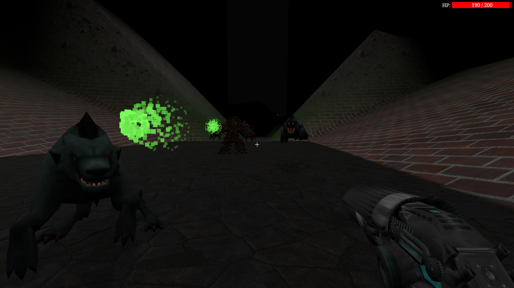

# Tuonela

## Инструкция
### Собрать
`cargo build --release`

### Запустить
`cargo run --release`

## Жанр
Бродилка с элементами экшена

## Описание
Вы оказались в Туонеле - мрачном и опасном мире.

По своей ли воле вы сюда попали или нет - неизвестно.
Ваша задача - добраться до конца и убить босса.

По пути вы встретите разные биомы, опасных врагов и оружие, которое можно подобрать.
Используйте свои ресурсы с умом.

## Управление
- **WASD** - передвижение
- **Мышь** - поворот камеры и атака
- **E** - поднять оружие / взять сердце
  - Оружие разбросано по биомам, каждое уникально
  - Сердца восстанавливают всё здоровье и дают +100 HP сверху
- **Q** - выбросить оружие
- **ESC** - пауза
- **F11** - включить/выключить полный экран

## Музыка
В игре используются композиции:
- https://youtu.be/PRvSHmsraRc
- https://youtu.be/Nh_d7LGIOCg

## Ресурсы
- https://opengameart.org/content/entangled-roots-with-animations
- https://opengameart.org/content/flying-terror
- https://opengameart.org/content/animated-wolf
- https://opengameart.org/content/fps-character-seal
- https://opengameart.org/content/mushroom-with-skeleton
- https://opengameart.org/content/low-poly-spider-glest
- https://opengameart.org/content/fps-character-worm
- https://opengameart.org/content/fps-character-beetle
- https://opengameart.org/content/glutton-demon
- https://opengameart.org/content/3d-turret-pbr-texture-flat-diff-texture
- https://opengameart.org/content/beating-heart
- https://opengameart.org/content/plasma-gun
- https://opengameart.org/content/plasma-gun-0
- https://opengameart.org/content/rocket-launcher
- https://opengameart.org/content/zapper-weapon
- https://sketchfab.com/3d-models/sci-fi-gun-102e95b9d68b47809b0bccfa71eac992
- https://freepbr.com
- https://freesound.org
